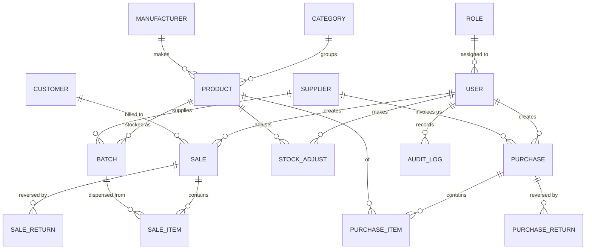
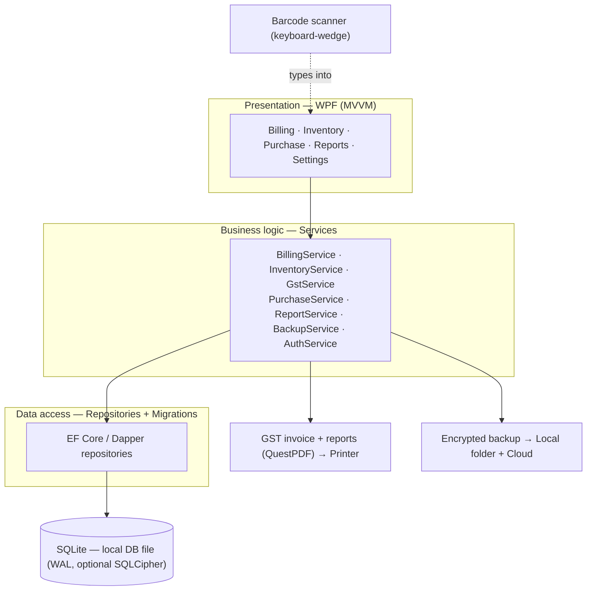
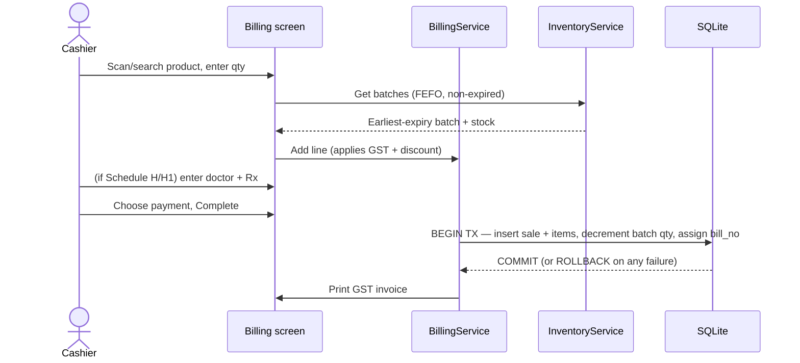

# Apex-Pharma — Master Project Plan (Canonical & Change-Controlled)

> **Project:** Apex-Pharma · **Repository:** https://github.com/Shuvrajit10101/Apex-Pharma
> **This is the single source of truth for the project — we follow it end-to-end.**
> **Change control:** minor changes and recommendations are welcome and must be logged in `memory.md`; **major changes require explicit client/owner sign-off** before entering this plan. Agents check every task against this plan and escalate conflicts rather than silently deviating.
> **Session read order:** `CLAUDE.md` → `plan.md` (this file) → `memory.md` → `agents.md`.

---

# Pharmacy Management System — Software Plan

**Target:** Single retail pharmacy / medical store · **Platform:** Offline-first Windows desktop app (local database, optional cloud backup) · **Market:** India (GST, Drug License, Schedule H/H1) · **Goal:** Production build to ship to a client.

*Prepared using the `/software` lifecycle (requirements → design → implementation → testing → deployment → docs/maintenance) and grounded in a study of three existing medical-store / pharmacy-inventory systems (Medical Store "Pharmiz", Hari-Om Medical Store, EM's Pharmacy). This plan keeps their good ideas and fixes the gaps common to all three.*

---

## 1. Executive summary

We will build **Apex-Pharma**: a fast, offline-first Windows desktop application that runs on the pharmacy's counter PC and handles the full retail workflow — **stock in (purchase/GRN) → sell (GST billing at POS) → track (batch + expiry) → report** — with the legal essentials for an Indian medical store (GST invoice, drug-license number on the bill, Schedule H/H1 prescription capture and register, mandatory batch + expiry).

It works with **no internet** (local database), bills in seconds (keyboard- and barcode-driven), never oversells or dispenses expired stock (batch-level FEFO with transactional stock control), and protects the business's data (hashed logins, role-based access, audit log, automatic local + cloud backup).

The three studied systems each did *part* of this; none did all of it, and none handled batch/expiry, GST, or Schedule-H compliance. This plan's core value is combining their strengths into one coherent, normalized, compliant, shippable product.

---

## 2. Vision & objectives

**Problem:** The pharmacy runs on manual registers (or a dated tool), which is slow at the counter, error-prone on stock and expiry, non-compliant on GST/Schedule-H paperwork, and gives the owner no real-time view of sales, margins, or what to reorder.

**Objectives (what success looks like):**

| # | Objective | Measurable success criterion |
|---|---|---|
| O1 | Fast, correct billing | A typical 4-item sale billed & printed in **< 30 seconds**; GST totals always correct |
| O2 | Accurate stock | On-hand quantity per batch is always right; **zero oversell**; expired stock cannot be sold |
| O3 | Expiry control | Near-expiry (e.g. ≤ 90 days) surfaced automatically; expired stock flagged for write-off |
| O4 | Legal compliance | Every sale prints a **GST-compliant invoice** with DL number; Schedule H/H1 sales captured with doctor/Rx and available as a register |
| O5 | Works offline | Full functionality with no internet; no data loss on power/PC failure (backups + transactions) |
| O6 | Owner visibility | Daily sales, profit, low-stock, and expiry reports available on demand |
| O7 | Shippable & maintainable | One-click installer; the client's staff can use it with minimal training |

---

## 3. Scope

### In scope (v1 → v2)
- User login with **roles** (Owner/Manager, Pharmacist, Cashier) and permissions
- **Masters:** products/medicines, categories, manufacturers, suppliers, customers, users
- **Purchase / GRN** from suppliers with **batch number + expiry + MRP + purchase price + GST**
- **Batch-level stock** with FEFO (first-expiry-first-out) dispensing
- **POS billing** with GST (CGST/SGST), discounts, multiple payment modes, barcode scan, **Schedule H/H1 doctor + prescription capture**, printed GST invoice
- **Returns:** sales return (restock) and purchase return (to supplier)
- **Stock adjustments:** expiry write-off, breakage/wastage, physical-count correction
- **Reorder:** low-stock report + purchase-order suggestions
- **Reports:** GST invoice, daily/periodic sales, profit, purchase, current stock & valuation, near-expiry & expired, low-stock, **Schedule H/H1 register**, GST/HSN summary for the accountant
- **Backup & restore:** automatic daily local + optional encrypted cloud backup; one-click restore
- **Settings:** pharmacy profile (name, address, **GSTIN**, **DL number 20B/21B**), invoice format, tax rates

### Out of scope for v1 (candidates for later)
- Multi-branch / multi-store consolidation *(architecture will not preclude it)*
- Online store / e-commerce / card & online payments
- Drug–drug interaction, contraindication, polypharmacy checks *(pharmacist's clinical judgement)*
- Full double-entry accounting *(we provide sales/purchase/GST data for the accountant; supplier & customer ledgers are lightweight)*
- Mobile app *(a possible v3 companion for owner dashboards/alerts)*

### Assumptions & constraints
- Single physical store; **1–2 billing PCs** sharing one local database on a LAN (confirm count — see §17).
- Windows PC at the counter; a **keyboard-wedge barcode scanner** and a **receipt/A5 printer** are (or will be) available.
- The pharmacy has a valid **GSTIN and Drug License**; product **HSN codes and GST rates** will be provided or entered.
- Internet may be **intermittent** — the app must never depend on it to make a sale.

---

## 4. Users & roles (RBAC)

Learning from the studied systems (which had a single hardcoded admin and plaintext passwords), we use **proper role-based access control** with hashed credentials and an audit trail.

| Role | Can do | Cannot do |
|---|---|---|
| **Owner / Manager** | Everything: masters, purchases, billing, returns, price/stock edits, all reports, users, settings, backup | — |
| **Pharmacist** | Billing (incl. Schedule H/H1), purchases/GRN, stock adjustments, returns, view reports | Edit prices/margins, manage users, change settings |
| **Cashier** | Billing, view stock/price, day-end summary | Purchases, edit products/prices, adjustments, reports beyond own sales, settings |

Every price change, stock adjustment, and deletion is written to an **audit log** (who/what/when).

---

## 5. Process model & team (how we build it)

- **Process:** Agile, **iterative with a Kanban board** — evolving requirements from a real client favour short feedback loops over a rigid Waterfall (all three source reports used Waterfall and shipped rigid, gap-ridden systems). Ship a thin, working slice early and refine with the pharmacist.
- **Cadence:** 1–2 week iterations; demo the running app to the client each iteration.
- **Team (minimum):** 1 full-stack .NET desktop developer (can ship this solo); ideally + 1 dev for parallelism and + part-time QA. The pharmacy owner/pharmacist is the **product owner** for feedback and acceptance.
- **Tracking:** GitHub Projects (or Jira/Linear) for backlog + board; GitHub Issues for bugs.
- **Definition of Done:** feature works, has automated tests for money/stock logic, is documented, and is accepted by the pharmacist on real-ish data.

---

## 6. Requirements

Priorities use **MoSCoW** (Must / Should / Could). "Must" = required for the shippable v1.

### 6.1 Functional requirements (by module)

**Authentication & users**
- M — Log in with username + password (hashed); log out; auto-lock after inactivity
- M — Manage users and roles (Owner only); enforce role permissions
- S — Password reset by Owner; force change on first login

**Product & catalog masters**
- M — Add/edit/deactivate a medicine: name, generic name, manufacturer, category, **HSN code**, **GST rate**, **schedule (None/H/H1/X)**, dosage form, strength, pack size, unit, rack/shelf location, **reorder level**, barcode
- M — Manage categories (e.g. Medication, Vitamins, Health Products) and manufacturers
- S — Import an initial product list from CSV/Excel (fast onboarding)

**Suppliers & customers**
- M — Add/edit suppliers: name, **GSTIN**, **DL number**, contact, address, state (for GST place-of-supply)
- S — Add/edit customers/patients: name, phone, address (for credit, returns, refill reminders)

**Purchase / GRN (stock in)**
- M — Record a purchase invoice from a supplier with line items: product, **batch no, expiry date**, quantity, purchase price, MRP, GST rate
- M — Saving a purchase **creates/updates batches** and increases batch-level stock
- S — Purchase return to supplier (by batch), decreasing stock
- C — Purchase-order generation from low-stock suggestions

**Billing / POS (stock out)** — the heart of the app
- M — Search product by name/barcode; **barcode scan** adds the line
- M — Auto-select batch by **FEFO** (earliest non-expired expiry); allow manual batch override; **block expired batches**
- M — Enter quantity; apply line/bill **discount**; compute **CGST/SGST** per line from the product's GST rate; correct rounding
- M — For **Schedule H/H1** items, capture **doctor name + prescription reference** before completing the sale
- M — Choose payment mode (cash/UPI/card/credit); complete sale in a **single DB transaction** that decrements batch stock (never negative)
- M — Generate a **sequential, unique bill number** and **print a GST invoice** (with pharmacy GSTIN + DL number)
- S — Hold/recall a bill; sales return (by bill no) that restocks the batch
- M — **Customer credit / khata** — bill "on account" with a running balance, part-payments, and an outstanding statement (client-confirmed for v1, 2026-07-01; `Customer.CreditLimit/Balance` already modelled)
- C — Loyalty points

**Inventory operations**
- M — View current stock by product/batch with expiry and valuation
- M — **Stock adjustment** with reason: expiry write-off, breakage/wastage, physical-count correction (audited)
- M — **Low-stock alert** when on-hand ≤ reorder level
- M — **Near-expiry alert** (configurable window, e.g. 30/60/90 days) and **expired list**

**Reports**
- M — GST tax invoice (reprint by bill no)
- M — Daily & date-range **sales report** with profit (sale − purchase cost)
- M — **Stock report** (current, by category, with valuation) and **near-expiry / expired** report
- M — **Low-stock / reorder** report
- M — **Schedule H/H1 register** (date, drug, batch, qty, patient, doctor, Rx ref) — legal requirement
- S — Purchase report (supplier-wise), **GST/HSN summary** (to hand to the accountant for GSTR-1)
- C — Owner dashboard with KPIs (today's sales, margin, top movers, dead stock)

**Backup & settings**
- M — Automatic **daily local backup**; **one-click restore**; manual backup on demand
- M — Pharmacy settings: profile, GSTIN, DL number(s), invoice header/footer, tax rounding, expiry-alert window
- S — **Encrypted cloud backup** (OneDrive/Google Drive/S3)

### 6.2 Non-functional requirements

- **Offline-first (M):** every core function works with no internet; cloud is only for backup/sync.
- **Data integrity (M):** billing, returns, and stock changes run in **ACID transactions**; stock can never go negative; bill numbers are unique and gap-checked.
- **Performance (M):** product search and add-to-bill respond in **< 300 ms** on a mid-range PC with 50k+ products; app cold-start < 5 s.
- **Reliability (M):** survive power loss mid-sale without corruption (transactional DB + WAL); daily backups; restore tested.
- **Security (M):** passwords hashed (PBKDF2/bcrypt), RBAC, audit log, optional at-rest DB encryption (SQLCipher); no plaintext credentials (a flaw in all three source systems).
- **Usability (M):** keyboard-first billing (works without a mouse), large legible fonts, clear expiry/stock warnings; a new cashier is productive in **< 1 hour**.
- **Compliance (M):** GST-compliant invoice layout; DL number on every invoice; Schedule H/H1 capture + register; batch + expiry mandatory on stock.
- **Maintainability (S):** layered architecture, database **migrations**, automated tests on money/stock logic, version control + CI.
- **Portability (C):** architecture keeps SQLite→SQL Server/PostgreSQL and single→multi-branch migrations open.

---

## 7. Domain & data model

The single biggest upgrade over all three source systems: **stock lives on the batch, not the product.** The same medicine arrives in batches with different expiry dates and MRPs, so quantity, expiry, and price belong to `Batch`. This enables FEFO dispensing, near-expiry reporting, and correct valuation — none of which the source systems could do. The schema is **normalized with foreign keys** (the Hari-Om system duplicated names into every table, risking inconsistency; we reference by ID).

### 7.1 Entity–relationship overview

### 7.2 Core entities (key fields)

| Entity | Key fields |
|---|---|
| **User** | user_id (PK), username, password_hash, full_name, role_id (FK), is_active, last_login |
| **Role** | role_id (PK), name, permissions_json |
| **Category** | category_id (PK), name |
| **Manufacturer** | manufacturer_id (PK), name |
| **Product** | product_id (PK), name, generic_name, manufacturer_id (FK), category_id (FK), **hsn_code**, **gst_rate**, **schedule** (None/H/H1/X), dosage_form, strength, pack_size, unit, rack_location, **reorder_level**, barcode, is_active |
| **Supplier** | supplier_id (PK), name, **gstin**, **dl_number**, phone, email, address, **state_code**, opening_balance |
| **Customer** | customer_id (PK), name, phone, address, credit_limit, balance |
| **Batch** | batch_id (PK), product_id (FK), **batch_no**, **expiry_date**, mrp, purchase_price, sale_price, **qty_on_hand**, supplier_id (FK), received_date |
| **Purchase** | purchase_id (PK), supplier_id (FK), supplier_invoice_no, invoice_date, subtotal, gst_amount, total, created_by (FK), created_at |
| **PurchaseItem** | purchase_item_id (PK), purchase_id (FK), product_id (FK), batch_no, expiry_date, qty, purchase_price, mrp, gst_rate |
| **Sale** | sale_id (PK), **bill_no** (unique, sequential), bill_date, customer_id (FK, nullable), doctor_name, prescription_ref, subtotal, discount, cgst, sgst, round_off, total, payment_mode, created_by (FK) |
| **SaleItem** | sale_item_id (PK), sale_id (FK), batch_id (FK), product_id (FK), qty, mrp, rate, discount, gst_rate, cgst, sgst, line_total |
| **SaleReturn / PurchaseReturn** | return_id (PK), original bill/purchase ref, batch_id (FK), qty, amount, reason, date, created_by |
| **StockAdjustment** | adjustment_id (PK), batch_id (FK), type (expiry/breakage/count), qty_delta, reason, date, created_by |
| **AuditLog** | log_id (PK), user_id (FK), action, entity, entity_id, before/after_json, timestamp |
| **Setting** | key (PK), value — pharmacy profile, GSTIN, DL numbers, invoice config, alert windows |

*The **Schedule H/H1 register** is derived (a report/query over `SaleItem` joined to `Product` where schedule ∈ {H, H1}, with `Sale.doctor_name` and `prescription_ref`) — no separate table needed, but the capture is enforced at billing.*

---

## 8. Architecture

**Style:** classic **3-tier / layered** desktop architecture (Presentation → Business logic → Data), single local database, with a backup service. Layering keeps money/stock rules out of the UI and makes a future move to client-server or multi-branch a swap of the data layer rather than a rewrite.

### 8.1 Recommended tech stack (with rationale)

| Concern | Recommendation | Why |
|---|---|---|
| Language / UI | **C# + .NET 8 + WPF** | Native, fast Windows desktop; mature; excellent offline story; huge hiring pool in India; easy printing & installers. *(Alt: Avalonia UI if cross-platform later; Electron/Tauri + React if you prefer web tech.)* |
| Database | **SQLite** (embedded, file-based) | Perfect for offline single-store: zero-config, ACID, WAL for crash safety; backup = copy one file. Scales to hundreds of thousands of rows easily. |
| ORM / data | **EF Core** (or Dapper for hot paths) | Migrations, LINQ, testable repositories. |
| Invoices / reports | **QuestPDF** (MIT) | Clean, code-defined GST invoices + PDF reports; prints to thermal or A5. |
| Auth | Local users, **PBKDF2/bcrypt** hashing | Fixes the plaintext-password flaw in all three source systems. |
| At-rest encryption (optional) | **SQLCipher** | Protects patient/business data on disk. |
| Barcode | **Keyboard-wedge scanner** | No integration needed — scanner "types" the barcode into the search box. |
| Backup | Scheduled job → local + **rclone/OneDrive/S3** (encrypted) | Cheap insurance against PC failure/theft. |
| Source control / CI | **Git + GitHub/GitLab (private)** + GitHub Actions | Build, run tests, produce the installer artifact on every push. |
| Packaging | **Inno Setup / WiX / MSIX** | One-click installer for the client's PC. |
| Testing | **xUnit** (logic) + FlaUI/manual (UI) | Automated tests on GST/stock math where correctness is non-negotiable. |

**Multi-PC note:** for 2 counters sharing one database, host the SQLite file on a small always-on PC/NAS over the LAN, or (cleaner) run **SQL Server Express/PostgreSQL** on that machine. Recommendation: **start on SQLite**; if concurrent billing from 2+ PCs is required day one, use **PostgreSQL/SQL Server Express on the LAN** behind the same data layer (confirm in §17).

---

## 9. Key workflows

**Sale / POS (happy path)**

Other workflows follow the same shape: **Purchase/GRN** (enter supplier invoice → create batches → stock up → supplier ledger), **Returns** (find original by bill/invoice no → restock/decrement in a transaction), **Expiry management** (near-expiry report → write off expired via audited adjustment; expired batches are un-sellable), **Reorder** (low-stock report → PO suggestions), **Day-end** (sales summary, cash reconciliation, backup).

---

## 10. UX / screens

Design principle from the source systems that worked: **user-friendly, menu-driven, minimal training.** We add **keyboard-first billing** because speed at the counter is everything.

Priority screens (wireframe on paper/Figma before coding):
1. **Login** → role-aware **home/dashboard** (today's sales, low-stock count, near-expiry count, quick search)
2. **Billing/POS** — the flagship: barcode/search box, line grid, live GST + total, F-key shortcuts (F2 search, F4 discount, F9 pay), batch/expiry shown per line, Schedule-H prompt
3. **Purchase/GRN** entry with batch + expiry grid
4. **Product master** (add/edit) and **stock view** (by product/batch/expiry)
5. **Reports** hub
6. **Settings** (pharmacy profile, GSTIN, DL, tax, alerts, backup)

UX guidelines: follow **Fluent/Windows** conventions + basic accessibility (contrast, font size, full keyboard operability). Show expiry and low-stock in **colour-coded** warnings.

---

## 11. Reports (deliverables the owner/accountant needs)

GST tax invoice · daily & date-range sales + **profit** · purchase (supplier-wise) · current **stock & valuation** · **near-expiry & expired** · **low-stock / reorder** · **Schedule H/H1 register** · **GST/HSN summary** (for GSTR-1) · customer outstanding (if credit enabled) · owner **KPI dashboard**.

---

## 12. Testing strategy

Testing is ~half the effort; correctness of **money and stock** is non-negotiable. Test at every level (unit → integration → system → acceptance) and automate the critical logic in CI.

**Must-pass test cases:**
- **GST math:** CGST/SGST split and rounding correct across rates (0/5/12/18%); discount applied before tax correctly.
- **Stock integrity:** concurrent/rapid sales never drive a batch negative; FEFO picks the earliest non-expired batch; **expired batch cannot be sold**.
- **Bill numbering:** unique, sequential, no gaps/duplicates even after a crash mid-sale.
- **Returns:** sale return restocks the exact batch; purchase return decrements it; amounts reverse correctly.
- **Transactions:** power-loss mid-sale leaves the DB consistent (no half-written bill).
- **Backup/restore:** a restored database is byte-for-byte usable; scheduled backup runs.
- **RBAC:** a cashier cannot reach owner-only screens; audit log captures edits.
- **Acceptance:** the pharmacist bills a real basket, does a return, receives stock, and signs off.

---

## 13. Deployment & operations

- **Environments:** Dev → Test (a spare PC with sample data) → Production (the counter PC). Never test on live data.
- **Packaging:** signed **Inno Setup/MSIX installer**; bundles .NET runtime, creates DB on first run, launches an onboarding wizard (pharmacy profile, GSTIN, DL, first user, optional product import).
- **Updates:** versioned releases (tagged in Git, built by CI); in-app "check for update" or manual installer; **migrations run automatically** and safely on upgrade.
- **Backup/restore:** automatic daily local backup + optional encrypted cloud; documented one-click restore; test the restore before go-live.
- **Go-live:** import existing product list + current stock (with batches/expiry), train staff (~1–2 hrs), run parallel with the old method for a few days.

---

## 14. Security & compliance

- Hashed passwords, RBAC, session auto-lock, full **audit log** of sensitive actions.
- Optional **at-rest encryption** (SQLCipher) for patient/business data.
- **GST-compliant** invoice (GSTIN, HSN, CGST/SGST, place of supply) and **DL number** on every bill.
- **Schedule H/H1**: enforce doctor + prescription capture at billing; maintain the retail **H1 register**.
- Batch + expiry mandatory; expired stock quarantined from sale.

---

## 15. Phased roadmap

*Estimates assume one experienced .NET developer; two devs roughly halve calendar time. Treat as ballpark for planning, to be firmed up per §17.*

| Phase | Delivers | Rough effort |
|---|---|---|
| **0 — Setup** | Repo, CI, layered skeleton, DB schema + migrations, auth + roles, settings/onboarding | ~1 week |
| **1 — Core MVP (shippable)** | Product/category/supplier masters, Purchase/GRN with batch+expiry, batch-level stock, **POS billing with GST + Schedule-H + FEFO + printed invoice**, low-stock & near-expiry reports, daily sales report, backup/restore | ~4–6 weeks |
| **2 — Round out** | Sales & purchase returns, stock adjustments/expiry write-off, customers + **credit/khata (client-confirmed v1)**, supplier ledger, full report suite (profit, GST/HSN, Schedule-H register), barcode polish, day-end | ~3–4 weeks |
| **3 — Post-launch enhancements** | Encrypted cloud backup/sync, owner KPI dashboard, refill/expiry SMS reminders, GST-return export, multi-branch groundwork | as prioritized |

**Recommendation:** ship **Phase 1** to the client as v1.0 (it's a complete, compliant, useful system), then iterate on Phases 2–3 with their feedback.

---

## 16. Risks & mitigations

| Risk | Mitigation |
|---|---|
| Data loss / PC failure | ACID transactions + WAL; automatic local **and** cloud backup; tested restore |
| Incorrect GST → legal/financial issue | Automated tax tests; accountant reviews invoice format before go-live |
| Overselling / wrong stock | Transactional stock decrement with non-negative guard; FEFO; physical-count adjustments |
| Schedule-H non-compliance | Enforced capture at billing + H1 register report |
| Scope creep (chain/online/mobile) | Explicit v1 scope; architecture keeps growth paths open without over-building now |
| Slow adoption by staff | Keyboard-first UX, minimal-training design, data import, on-site training + parallel run |
| Multi-PC contention | Decide counter count up front (§17); use PostgreSQL/SQL Server Express on LAN if 2+ concurrent billers |

---

## 17. Decisions to confirm with the client

1. **Billing counters/PCs:** how many bill *at the same time*? (1 → SQLite is ideal; 2+ concurrent → LAN PostgreSQL/SQL Server Express.)
2. **Credit customers (khata):** ✅ **YES — in v1** (confirmed 2026-07-01).
3. **Hardware:** barcode scanner model, printer type (thermal 3-inch vs A5 laser), and the counter PC's Windows version/specs.
4. **Existing data:** is there a product list + current stock (with batch/expiry) to import? In what format?
5. **GST/HSN source:** who provides per-product HSN codes and GST rates?
6. **Cloud backup:** preferred provider (OneDrive/Google Drive/S3) or local-only for now?
7. **Invoice branding & DL type:** logo, header/footer, and DL number type (retail **20B** / wholesale **21B**).
8. **Product name:** ✅ **Apex-Pharma** (confirmed 2026-07-01).

> **§17 status:** all 8 answered 2026-07-01 — see `memory.md` → "Client Answers" for the full set (1 counter→SQLite · khata in v1 · thermal-receipt-first · CSV/Excel importer · GST defaults-now · backup local+cloud · retail-only · name Apex-Pharma).

---

## 18. Appendix — what we kept and fixed from the three studied systems

**Kept (proven ideas):**
- Master → transaction data model with **bill-number traceability** for returns *(Hari-Om)*
- **POS that auto-decrements stock**, category-based catalog, expiry & dosage as first-class fields, low-stock warning, role separation, profit in the sales report *(EM's Pharmacy)*
- Expiry **alerts**, accounting/ledger thinking, multi-role separation, drug-list import & convenience features *(Pharmiz)*

**Fixed (gaps common to all three):**
- Added **batch/lot tracking with per-batch expiry and FEFO** (none had it — the #1 real-pharmacy miss)
- Added **GST (CGST/SGST + HSN)**, **drug-license number on invoices**, and **Schedule H/H1** capture + register (none were legally billable in India)
- **Normalized** the schema with foreign keys (Hari-Om duplicated names into every table)
- Real **security**: hashed passwords, RBAC, audit log (all three stored/handled credentials weakly)
- Added **supplier purchase-order/GRN**, **reorder automation**, **returns/adjustments/wastage**, **barcode**, and **backup/restore** (variously missing)
- Chose a modern **offline-first, testable, layered** build over the dated Waterfall/monolith stacks (HTML-only, VB.NET 2008, XAMPP/PHP) the reports used

---

*Plan produced with the `/software` skill. Sources studied: `365348816-Medical-Store-management-system.pdf`, `371478541-Medical-Inventory-Management-System.pdf`, `699760092-EM-S-PHARMACY-INVENTORY-MANAGEMENT-SYSTEM.pdf`.*
